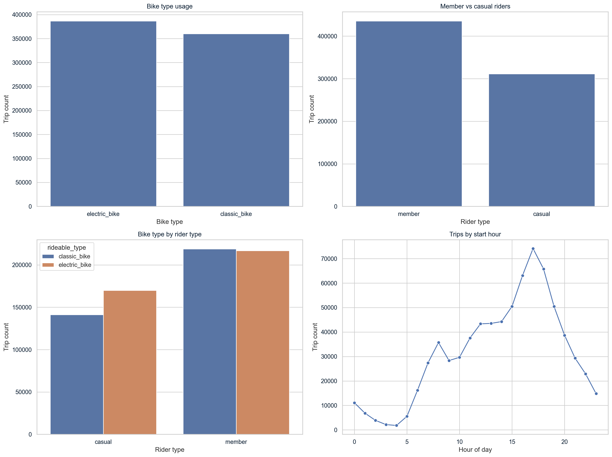
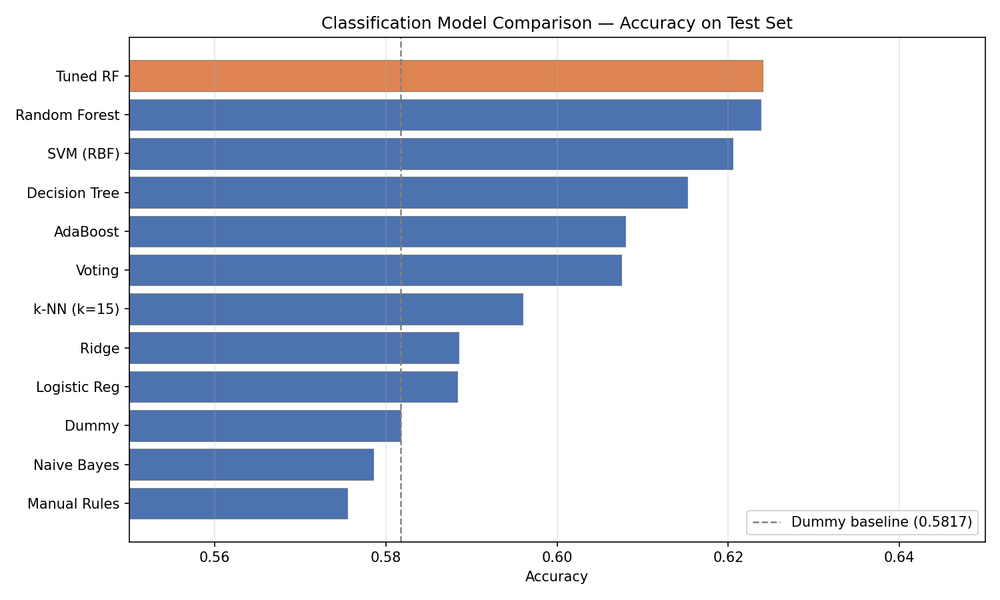
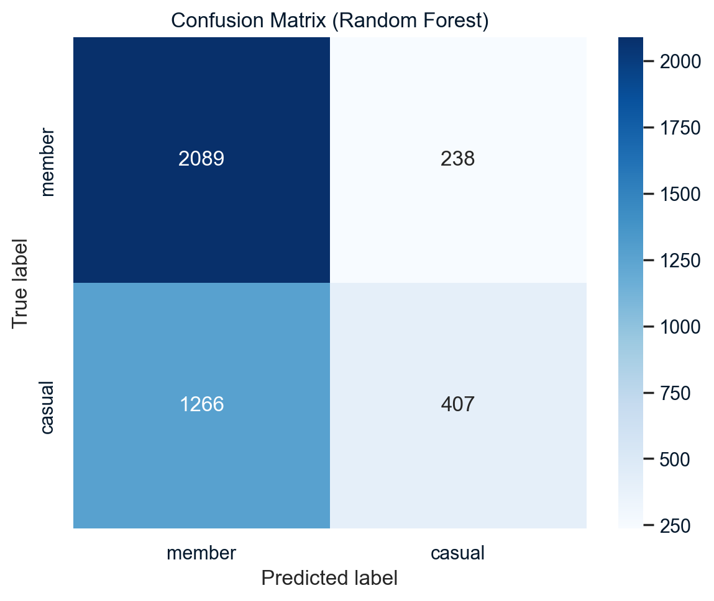
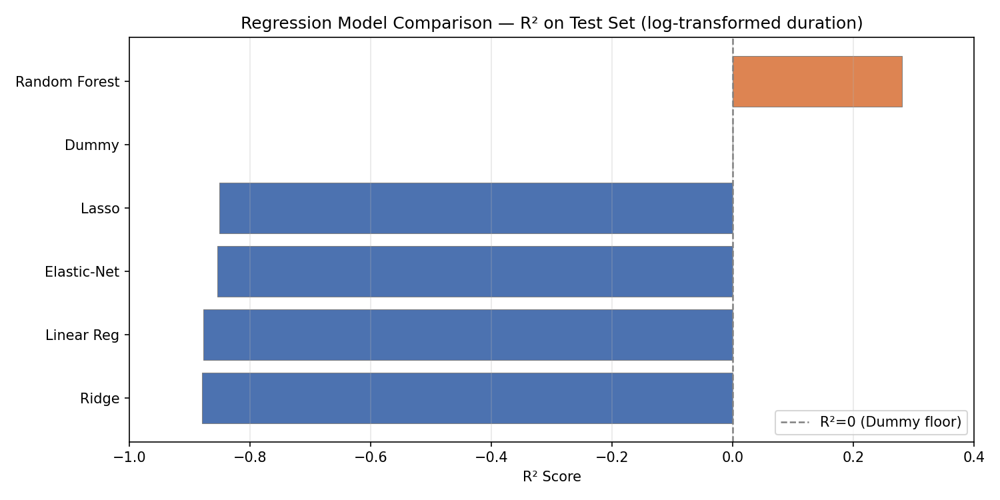
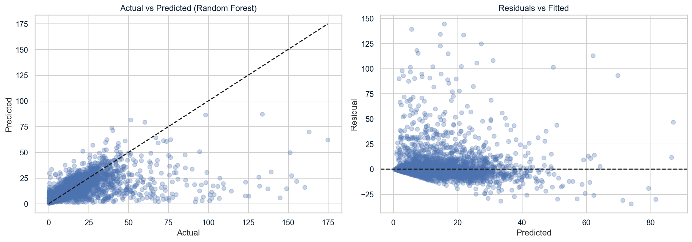
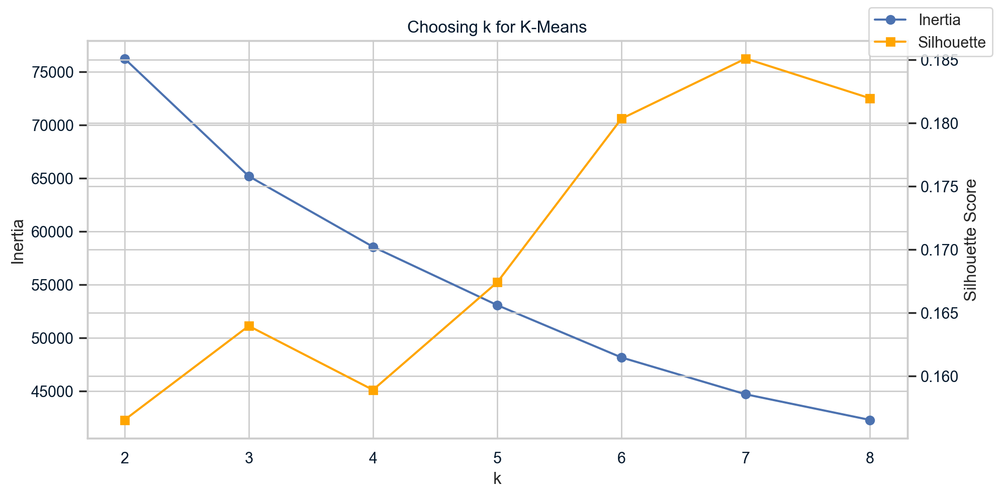
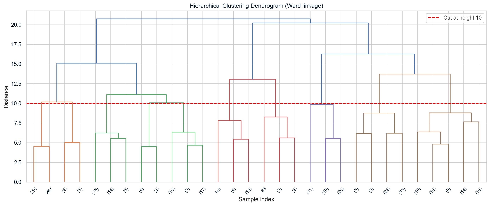
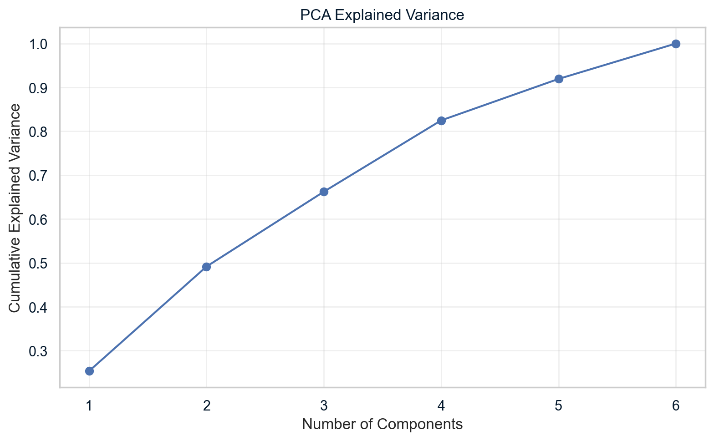

# Chicago Divvy Bikeshare — ML Foundations Project

A machine learning project working through classification, regression, clustering, and PCA on real bikeshare trip data from Chicago's Divvy system.

## The Dataset

I used the July 2023 Divvy dataset. Divvy is Chicago's public bike-share system. The raw data has about 767k trips and 13 columns. After cleaning I had 746k rows and 19 columns. For the actual modeling I took a 20k-row stratified sample so the training would run faster.

The main columns I used are `member_casual` (the classification target), `rideable_type` (classic or electric bike), start and end timestamps, and GPS coordinates. I also engineered some new features: `trip_duration_min`, `trip_distance_km` (computed with the haversine formula), `hour`, `day_of_week`, `is_weekend`, and `rush_hour`.

The class split is 58.3% member and 41.7% casual. It's a bit imbalanced, which matters when you look at accuracy.

*Members outnumber casual riders by about 3-to-2 in this July sample.*

## What I Was Trying to Do

**Classification.** Given trip features like bike type, time of day, start location, and distance — can I predict if the rider is a member or a casual user? Members have annual passes and use the system differently. More commuting, shorter trips.

**Regression.** Can I estimate how long a trip will take from the same features? This is harder because trip duration depends on things I don't have in the data — traffic, rider fitness, route choice.

**Clustering and PCA.** Without using the rider type label, do trips naturally fall into groups? And can PCA simplify the feature set to something I can plot on a 2D graph?

## Data Prep & Feature Engineering

The raw data had some problems. A few hundred rows had missing end coordinates — I dropped those. Some trips had negative durations, probably from clock drift — dropped those too. I capped trip duration at 120 minutes and distance at 50 km to keep the models focused on realistic trips.

The features I created:
- **trip_distance_km**: straight-line distance from start to end coordinates using the haversine formula. It's an underestimate of actual road distance but it's the best I can do without route data.
- **hour** and **day_of_week**: extracted from the started_at timestamp. Bike usage shifts dramatically by time of day.
- **is_weekend** and **rush_hour**: binary flags for behavioral context. Rush hour covers 7–9 AM and 4–6 PM on weekdays.
- **log-transformed duration**: the raw trip duration has a long right tail. Linear models can't handle this well, so I applied log1p for regression.

I built separate preprocessing pipelines for classification and regression. The classification pipeline does not use trip duration — that would be data leakage because you don't know the trip duration until the ride is over.

## Classification — Who's Riding?

I tested 10 classifiers plus a dummy baseline. The goal was to predict member vs casual from trip features alone — no duration, no rider ID, just what you'd know at trip start.

*Tuned Random Forest comes out on top. The dashed line is the Dummy baseline — anything to its left is worse than just predicting the majority class every time.*

**Dummy Classifier** (baseline): always predicts "member" since that's the most common class. 58.17% accuracy. This is the bare minimum — any model below this is useless.

**Manual Rule Classifier**: I wrote a set of if-else rules by hand — "if weekend and long distance, predict casual", "if rush hour, predict member". It scored 57.55%, which is below the dummy baseline. That was the first sign that the boundary between member and casual isn't something you can capture with simple heuristics.

**Logistic Regression**: fits a straight line to separate the classes. It is fast and gives you coefficients you can look at. But the classes aren't linearly separable here, so 58.83% is about what I expected.

**k-NN (k=15)**: looks at the closest training examples and votes. Feature scaling matters here, which is why I put it in the pipeline. I tested different k values and 15 was the best. Higher k means smoother decision boundaries. Got 59.60%.

**SVM (RBF kernel)**: this surprised me a bit — 62.05%, the second-best score. The RBF kernel lets SVM draw non-linear boundaries without manually engineering interaction features. I think it worked well here because the data has a mix of categorical and continuous features that aren't linearly separable, exactly the kind of setup where a kernel method shines.

**Naive Bayes**: assumes all features are independent of each other within each class. That's a bad assumption here — distance and duration are correlated. It scored 57.85%.

**Ridge Classifier**: a linear model with regularization. Similar to logistic regression in practice. 58.85%.

**Decision Tree (max_depth=8)**: the train-test gap is the interesting thing here — 65.77% train vs 61.52% test. A single tree memorizes patterns that don't generalize, even with depth capped at 8. You can extract the actual rules from it, which is useful for understanding, but I wouldn't trust it for prediction on new data.

**Random Forest (100 trees)**: builds many decision trees and averages their predictions. This reduces the overfitting problem. 62.38% on test, 79.17% on train. The gap is still there but it's much better than a single tree.

**Tuned RF (GridSearchCV)**: I ran a grid search over n_estimators, max_depth, and min_samples_leaf — the best model hit 62.40% vs the untuned RF's 62.38%. That 0.02% gain for several minutes of compute is honestly underwhelming. scikit-learn's defaults were already almost optimal for this data.

**Voting Ensemble** (LR + DT + k-NN): combines three different model types and takes a majority vote. The idea was to smooth out individual model mistakes. Got 60.75%.

**AdaBoost (50 estimators)**: builds trees one after another where each new tree focuses on the examples the previous ones got wrong. 60.80%.

The tuned Random Forest wins, but 62.4% is not a dramatic improvement over the baseline. Members and casual riders don't separate cleanly on trip features alone — especially in July, when both groups take leisure trips.

*The model gets most members right (2089 out of 2327) but struggles badly with casual riders — it predicted 1266 of them as members. When in doubt, it defaults to the majority class.*

## Regression — How Long Will the Trip Take?

For regression I switched targets to trip duration (log-transformed). This turned out to be the harder problem.

*Only Random Forest scored above the dummy baseline. All linear models were negative.*

**Dummy Regressor**: always predicts the average trip duration. R² = 0.0 by definition. This is the floor.

**Linear Regression**: R² = -0.877. This is worse than just predicting the mean every time. The problem is that none of the features have a straight-line relationship with trip duration.

**Ridge, Lasso, Elastic-Net**: these are all linear models with different types of regularization. Ridge got -0.880, Lasso got -0.851, Elastic-Net got -0.854. Regularization did not fix the problem because the issue isn't large coefficients — it is that the underlying relationship is not linear.

**Random Forest Regressor**: R² = 0.281, RMSE = 13.98 minutes. The only model that learned something useful. It handles non-linear interactions between distance, time, and location.

Negative R² means the model is actively worse than guessing the average. If you always predicted 15.4 minutes (the mean), you'd be off by 16.5 minutes RMSE. The linear models somehow manage to be off by 22+ minutes. The problem is that short and long trips share the same feature values — a 5-minute trip and a 50-minute trip can have the same distance and start location if one rider bikes fast and the other takes the scenic route.

*Random Forest residuals are centered around zero but spread increases for longer predicted durations — the model is less certain about longer trips.*

## Clustering — Finding Trip Patterns

I removed the labels and asked: do trips form natural groups?

**K-Means**: splits the data into k clusters. The algorithm tries to make points inside each cluster as close together as possible. I tested k=2 through k=8 and used the elbow method and silhouette score to pick the best value.

*No sharp elbow — the silhouette peaks at k=7 but values are low across the board.*

The best silhouette score was 0.185 at k=7. That is pretty weak — the data does not form tight clusters.

**Hierarchical clustering**: builds a tree by merging the closest points at each step. I cut the tree at 2, 3, and 4 clusters to compare with K-Means. The best silhouette was 0.182 at k=3 — similar to what K-Means gave.

*No large jump in merge distance, confirming the data is fairly continuous.*

**DBSCAN**: defines clusters as dense regions and marks sparse points as noise. It found 2 clusters and labeled 176 points as noise out of 15,000. The silhouette was 0.544 on the non-noise points, but that is misleading — it only looks at the easy points and ignores the outliers.

K-Means was the most useful of the three. The cluster profiles made sense — one cluster was mostly short weekday commutes, another was longer weekend leisure trips. But even then, the low silhouette scores tell the real story: the trip data is fairly continuous and does not have clean boundaries between groups.

## PCA

After one-hot encoding I had around 20 features, and some of them are correlated with each other. PCA compresses these into a smaller set of uncorrelated components.

*Two components capture 49.2% of variance; three capture 66.2%.*

The loadings show what each component captures:
- **PC1** (28% variance): mostly start_lat and start_lng. This is a location component.
- **PC2** (21% variance): mostly trip_duration_min and trip_distance_km. This tracks trip size.
- **PC3** (17% variance): mostly hour and day_of_week. Time patterns.

When I plotted the data in PC1–PC2 space, members and casual riders overlap a lot. This matches the 62% classification ceiling — there is some signal but it is weak.

## Key Takeaways

The clearest result is that Random Forest was the only model that worked for both tasks. Linear models couldn't handle the non-linear relationships, and regression in particular punished them with negative R² — they were actively worse than guessing the average. That's not because linear regression is a bad algorithm, it's because trip duration doesn't scale linearly with any available feature. A 5-minute trip and a 50-minute trip can have the same distance and start location.

Regression turned out to be much harder than classification. Even the best model (R² = 0.28) leaves most of the variance unexplained. Looking back, that makes sense — trip duration depends on things I don't have: weather, rider age, route elevation, how long someone spent at a red light. You'd need more data to do better.

The negative R² scores were the most educational part of the project. They make it really obvious when a model is a bad fit. If I'd only looked at RMSE, I might have thought the linear models were just "kinda bad." The negative R² says they're systematically broken for this problem.

Clustering was the least satisfying section. Silhouette scores below 0.2 across all three methods — the trips just don't form clean groups. That's not a bug in the algorithms, it's an honest property of the data: bikeshare trips in a summer month are a smooth mix of commuting, errands, and leisure with no hard edges between them.

The 62% classification ceiling bugged me until I remembered it's July. In winter, casual riders basically disappear — the split would be more like 80/20 and the classification signal would be stronger. But July is peak tourism, so members and casuals both take short recreational trips along the lakefront. They're harder to tell apart. If I were doing this again, I'd compare summer and winter months side by side.

## How to Run

1. Install Python 3.9+ with pandas, numpy, scikit-learn, matplotlib, seaborn, pyarrow, scipy
2. Place `202307-divvy-tripdata.parquet` in the repo root
3. Open `bikeshare_notebook.ipynb` in Jupyter
4. Run all cells top to bottom

## Stack

Python, pandas, numpy, scikit-learn, matplotlib, seaborn, pyarrow, scipy
